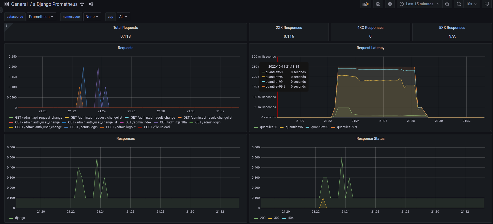

# Sample API using Django Rest framefork to compute CSV and XLSX files in the format Operand A | operation | Operand B

## Installation

This API is running in a docker container and all needed services are run using Docker and Docker Compose. It is for a development purpose so a Django local database is used.

To run all the containers just run `docker compose up`

This will run the Django server, RabbitMQ messaging broker, Celery for the async tasks,  Prometheus and Grafana.

## Usage

In order to be able to make POST requests to the API for computation you need to register first.

Make a POST request to `http://localhost:9001/api/register` with body parameters - `email, password, password_confirmed, username`. If the request is successful you will receive as a response containing your username and email.

After that generate for your account a token which will be used for the rest of the requests.

Again make a POST request this time to `http://localhost:9001/api/api-token-auth/` with body parameters your `username` and `password`. If the request is successful the server will return your token as a response.

To use the API make a POST request to `http://localhost:9001/api/compute/` with  Header `Authorization:Token {your_token}` and the file you would like to upload for computation.

Sample Request

`curl -X POST -F "file=@{filename}" -H "Authorization:Token {your_token}}" http://localhost:9001/api/compute/`

Sample CSV file content

`1,+,2`  
`2,-,3`

## Admin UI Login

### As regular user
To see your result go to `http://localhost:9001/api/admin/` and login with your username and password. You will only be able to view the requests you have made with the corresponding results. The status column on the results page displays what is your request status. They can be ERROR in case of an issue with the file content such as incorrect characters, DONE if the calculation is completed or IN PROGRESS if the file is still being computed.

### As an admin user
In order to access all requests and results for all users you will need
to login with an admin user. You will also be able to view all registered users. An admin user is already created. The credentials are 'itodorov/test1234'.

## Metrics

In order to view Prometheus dashboard go to `http://localhost:9091/` and search for the desired metrics. The django-prometheus plugin provides cool metrics out of the box.

Head to `https://github.com/korfuri/django-prometheus` to view more about the package.

The Grafana Dashboard is located on port 3000. Open `http://localhost:3000`
and login with `admin/admin` for username and password. To setup Grafana to use the collected metrics from Prometheus add new Datasource. Select Prometheus and for URL type `http://prometheus:9090`. Click `Save and Test` button to check if the connection is successful. You can now create the desired dashboard with Prometheus metrics.

Configured dashboard with Django metrics

## Continuous integration pipeline

The CI pipeline covers the DEV scenario consisting of running Python Linter flake8 and running the Django unit tests. It is triggered on each commit to `dev` branch and pull request to `main` branch. It is implemented using GitHub Actions.
